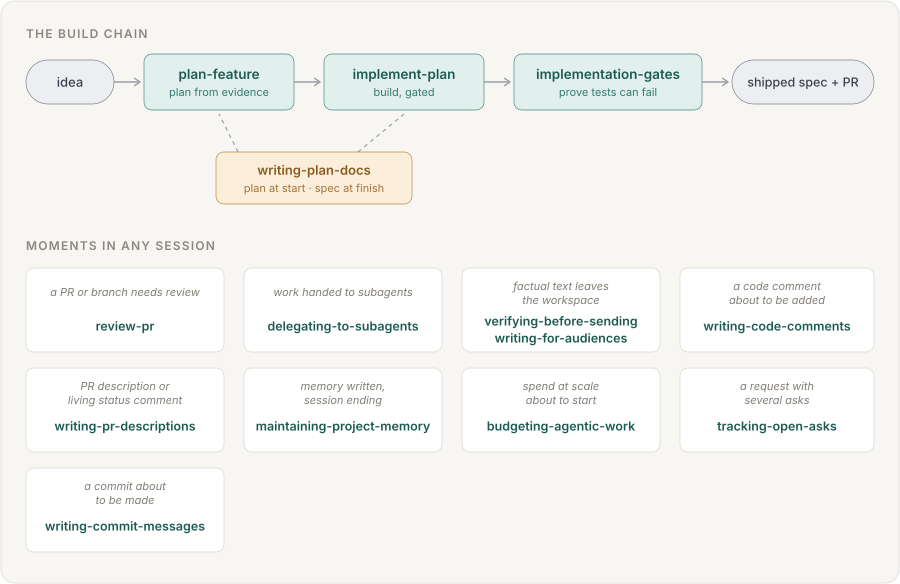
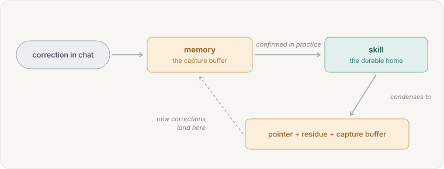

# Claude delivery skills

[](https://github.com/ViktorSoroka07/claude-delivery-skills/actions/workflows/guard.yml)
[](LICENSE)

A [Claude Code plugin](https://code.claude.com/docs/en/plugins) — <!-- inventory -->eighteen skills, three agent types, and eight hooks<!-- /inventory --> — that hardens the path from idea to merged PR, and
the moments around it. It exists because the failure mode of agent-driven development
is rarely the code itself: it is everything around the code. Plans built on unverified claims. Tests that pass but would never have
failed. Subagent reports treated as facts. Messages that read fine and are wrong.
Comments nobody needed. Spend nobody priced.

Each skill is a `SKILL.md` instruction package. Claude Code loads it when the task
matches, and the instructions change how the model works — what it checks, in what
order, and what it refuses to skip. Every rule was paid for by a real incident; the
catalog below tells you which problem each piece solves, so you can judge the set
without reading every file.

## The map

Four skills form the build chain and a fifth closes the work out after the merge; the other
thirteen guard moments that can occur in any session, at any time.



## Which skill do I need?

Every row is the skill's own trigger sentence, generated from its file, and the rows run
in the order of the catalog below, so neighbouring rows are the same kind of moment — scan
the left column and stop at the row that matches what you are about to do. The catalog
after this one explains *why* each exists; this table only answers *when*.

<!-- triggers -->

| Reach for it when | Skill |
|---|---|
| starting new work from an idea rather than from an existing plan — "I want to build X", "let's add Y", "can we change how Z works", "plan this feature". Ends at a plan; implementation is a separate skill (implement-plan). | [`plan-feature`](skills/plan-feature/SKILL.md) |
| a plan document already exists and the work should now be built — "implement this plan", "execute the plan", "go ahead with docs/plans/X.md" — or when continuing after plan-feature. | [`implement-plan`](skills/implement-plan/SKILL.md) |
| implementation work is about to be called done or complete, after the repo's own gates have passed — and while writing a plan or spec, to settle its claims about outside systems (APIs, data, libraries) against evidence before they become design decisions. | [`implementation-gates`](skills/implementation-gates/SKILL.md) |
| creating, rewriting, or syncing a document a reader will later consult for current state, whether a plan or spec (docs/plans or equivalent), a findings or analysis report, or a research write-up. Triggers at feature start, when implementation ships, after a merge with the target branch, after review fixes land, and whenever a later finding overturns a conclusion the same document already states. | [`writing-plan-docs`](skills/writing-plan-docs/SKILL.md) |
| work has landed on its target branch — a merged PR or MR, a completed local merge — and the branch, worktree, memory entries and tracker item it leaves behind need closing out; and, as a separate ask, when deciding which existing local branches and worktrees are safe to delete. | [`landing-merged-work`](skills/landing-merged-work/SKILL.md) |
| asked to review a pull request or branch — "review PR 42", "review this branch", "look over my changes", "deep review" for the exhaustive pass, or names one area to review — and for the later asks on a review already produced — post, stage, apply, or reply-and-resolve its threads. GitHub, Azure DevOps, and GitLab. | [`review-pr`](skills/review-pr/SKILL.md) |
| review feedback has arrived on your own pull request or merge request — from a person, a review bot, or a scanner — and it needs working through — "address the comments", "go through the review", "check the bot threads", "reply to the reviewers", "resolve the threads"; and, when asked to, re-checking threads already marked resolved — "check the resolved threads too", "re-check the resolved ones before we merge". | [`addressing-review-feedback`](skills/addressing-review-feedback/SKILL.md) |
| filing a defect, a data point or an improvement request into a system another team owns — a shared pipeline, a platform, an internal tool, a library — that they did not ask you to review; and when reviewing such a report before it is sent. | [`reporting-defects-upstream`](skills/reporting-defects-upstream/SKILL.md) |
| handing work to subagents — writing dispatch briefs, partitioning parallel edits across agents, deciding whether a silent agent is stuck — and whenever anything a subagent produced is about to be used — an identifier wired into code, a diff committed, a finding acted on, a "done" accepted. | [`delegating-to-subagents`](skills/delegating-to-subagents/SKILL.md) |
| factual text is about to leave the workspace for someone else's surface — a message a teammate will act on, a comment on another person's PR or work item, instructions another engineer will build against, skill or agent-instruction text a future session will obey, spec or wiki content other teams read — and earlier, before drafting such text at all. | [`verifying-before-sending`](skills/verifying-before-sending/SKILL.md) |
| writing prose a specific person or audience will read, act on, or hear — a report, a deck or speech, teaching material, an explanation, a message — and when a reader signals they did not understand ("what is this number of?", "explain it in simpler terms", "I don't get what you mean"). | [`writing-for-audiences`](skills/writing-for-audiences/SKILL.md) |
| writing or editing code and a comment is about to be added — new modules, bug-fix rounds, review-fix rounds, test files — and when auditing a diff's comments (your own or a delegate's) before commit. | [`writing-code-comments`](skills/writing-code-comments/SKILL.md) |
| creating a pull request, writing or editing a PR title or description, when commits have landed on a branch whose PR description may no longer match — including "sync the PR description" and "update the PR body" asks — and when maintaining a living status comment on a PR or issue. GitHub and Azure DevOps. | [`writing-pr-descriptions`](skills/writing-pr-descriptions/SKILL.md) |
| a commit is about to be made — "commit this", staged changes waiting, a fix-up after review, a delegated diff the orchestrator is committing — and when a commit message is being edited or squashed before a push. | [`writing-commit-messages`](skills/writing-commit-messages/SKILL.md) |
| writing, pruning, or restructuring project memory entries, when a merge or shipped milestone leaves memory describing finished work, when ending a session whose work continues in a later one — and whenever a statement is about to be copied from chat, a memory, or one document into another. | [`maintaining-project-memory`](skills/maintaining-project-memory/SKILL.md) |
| launching work that will spend real money or context at scale — multi-agent passes, multi-phase implementations, long-running pipelines — when a session approaches a budget or context ceiling, and when unplanned rework cost has appeared. | [`budgeting-agentic-work`](skills/budgeting-agentic-work/SKILL.md) |
| a request contains more than one ask, when new asks arrive while work is already running, at any checkpoint or session end where status gets reported, and whenever a question, decision or action is handed to the requester. | [`tracking-open-asks`](skills/tracking-open-asks/SKILL.md) |
| asked to fetch, sync, refresh or update the git repos in a folder rather than one at a time — "sync all my repos", "fetch everything under this directory", "which of these clones are behind", "bring my checkouts up to date" — and when surveying what has moved across many clones before starting work. Runs a bundled script; the judgement is in reading its output, not in doing the git work by hand. | [`git-sync`](skills/git-sync/SKILL.md) |

<!-- /triggers -->

## What each skill solves

### The build chain

**[`plan-feature`](skills/plan-feature/SKILL.md) — a coherent plan can still be false.**
A design that argues its premise well for three sentences can be wrong about what an
API returns or a column means — and implementation will build on it faithfully. The
skill ground-truths every claim about systems you did not write *before* the plan is
written (read-only checks: real data, then an existing consumer, then docs — a coherent
argument is not evidence), puts the plan on the work's branch — created only when the
session is on the default branch — commits it there where the repo commits plans, then
stops so the plan can be read before anything is built. Before handing the branch back it
checks that the branch tracks nothing but its own name: an upstream naming the default
branch turns a later push into a silent commit to the default branch.

**[`implement-plan`](skills/implement-plan/SKILL.md) — the gate that is not written into the plan does not run.**
Executors obey the plan, so a verification step that lives only in good intentions gets
skipped. The skill patches the plan with a gates task before execution starts, checks
the plan's premises were settled rather than argued, delegates the build to the repo's
own execution skill, and finishes by rewriting the plan as the spec of what shipped.

**[`implementation-gates`](skills/implementation-gates/SKILL.md) — green is not the bar; "would it have gone red" is.**
Thirteen mutations once survived a suite that honestly passed: the tests could not fail.
The skill runs ten to twelve targeted mutations over the new lines (every non-equivalent
survivor is a missing assertion), re-checks the design's claims about outside systems
against evidence, and keeps written verification records to exactly what ran.

**[`writing-plan-docs`](skills/writing-plan-docs/SKILL.md) — the doc describes the destination, never the route.**
Plan documents decay into changelogs — deviation lists, review-round narration, stale
counts — that mislead the person reading them later. The skill keeps the doc a
current-state spec: superseded content replaced rather than annotated, verification
records that outlive the branch, references that resolve against a tree that has moved.

### After the merge

**[`landing-merged-work`](skills/landing-merged-work/SKILL.md) — the merge is where ownership lapses.**
The finishing skill hands a branch off while its request is still open, and the work
lands later — another session, a browser tab, someone else's approval — with nothing
listening. What is left behind: a branch every ancestry command calls unmerged (the
squash broke the link), a worktree nobody claims, memory describing finished work, and a
tracker item closed in fact and open on the board. The skill pairs each leftover with
the check that closes it, and keeps the one rule that matters most if the list is ever
trimmed: never trust an empty result from a command whose exit status went unchecked,
because a failed check prints the same nothing as a clean one.


### Reviewing

Three skills, three seats: what was asked for, and whose work it is, decide which one fires.


**[`review-pr`](skills/review-pr/SKILL.md) — one careful reader misses what measurement and adversarial checks catch.**
A single reviewer finds what a single way of reading finds; and a review's own findings
are claims that can be wrong. Two passes: parallel single-axis agents (chosen from the
diff, never the full set) plus a mutation agent that measures instead of reads — then a
fresh-eyes verifier prompted to *refute* every draft finding before anything is reported,
and confirmed findings grouped into one thread per problem. Posts nothing without
being asked.


**[`addressing-review-feedback`](skills/addressing-review-feedback/SKILL.md) — the author's seat: every item, every verdict, every reply pointing at something the reviewer can see.**
Feedback on your own change arrives from people, review bots and scanners across inline
threads, review bodies with collapsed nitpicks, and request-level comments — and the
recurring failures are an item nobody listed, a suggestion applied because the reviewer
is usually right, a "fixed in" reply citing a commit that exists only locally, and a
thread resolved over code that never changed. The skill inventories every surface before
any verdict, verifies each claim against the layer that owns it, and keys fix replies to
the remote rather than the commit. Resolved threads are counted, not read: re-checking
them is a mode the user asks for, so a repeat round pays only for what changed.

**[`reporting-defects-upstream`](skills/reporting-defects-upstream/SKILL.md) — the outsider's seat: nobody asked, so the report brings evidence and leaves the decisions.**
A report filed into a system another team owns is read as a verdict on work they chose,
and the sentences that sink it are the polite ones. Listing only failures implies the
system mostly fails, so the true proportion of what works is an accuracy rule rather
than a courtesy — and flattery breaks it in the same direction as an overstated defect.
The rest is standing: pricing their work, ranking their priorities, asserting a change
is safe in their codebase, and phrasing a suggestion as an instruction are all decisions
taken from the owner, and a scan for rude vocabulary passes over every one of them.

### Working through subagents

**[`delegating-to-subagents`](skills/delegating-to-subagents/SKILL.md) — a subagent's output is a claim about work, not the work.**
Real incidents: a research agent invented a tool name ("confirmed from source") and the
shipped check rejected every input; delegated diffs carried the agent's monologue into
commits; and reports simply never arrived. The skill governs what dispatch
guides lack — collision-safe partitioning, delivery instructions, liveness checks before
taking over, verifying every reported identifier, auditing every delegated diff.

### The send moment — two skills, one axis each

Text about to leave the workspace fails more than one way at once, so two skills fire
together and split the work: one asks *are the claims true?*, the other *does the
prose fit the reader?*


**[`verifying-before-sending`](skills/verifying-before-sending/SKILL.md) — text that reads fine and is wrong.**
A blind pass once corrected four claims in a document that had already passed
self-review, and found a defect that would have failed every run of a process another
engineer was about to build on. Fact table before writing; verification by a fresh
context that never saw the reasoning; three named traps (absence claimed from a truncated
search, a negative claimed from one function, a tracker marker called stale without its
edit history); two passes maximum, then the warrant stated — never the feeling.

**[`writing-for-audiences`](skills/writing-for-audiences/SKILL.md) — prose the reader cannot use, or should not have.**
"40%" invites "of what?"; two numbers measured under different conditions are not one
comparison; and a task description condensed from an internal backlog once delivered
interpersonal framing onto a shared board. Register matched to the reader, every number
carrying its base, an audience gate that re-derives text instead of condensing it, and
formatting for how the text is actually used — copied, spoken, skimmed.

### Writing artifacts

Three artifacts, one rule: each records the change, never the session that produced it.

**[`writing-code-comments`](skills/writing-code-comments/SKILL.md) — subtractive comment rules keep failing; give the fact a home.**
"Don't write comments" collapses the moment a fact feels load-bearing — which is why
the correction kept recurring. Zero by default at write-time, an invariant-plus-cost
shape when one is earned, and the escape hatch that makes the default hold: the
load-bearing fact becomes an expression, an assertion that fails when broken, or a
named constant — never prose.

**[`writing-pr-descriptions`](skills/writing-pr-descriptions/SKILL.md) — describe the diff, not the branch.**
Descriptions accumulate review-round narration and references that die on squash-merge.
The contract: net delta grouped by behavioral change, the deliberate scope boundary,
references that survive history rewrites — and at most one living status comment,
edited in place, never a stack.

**[`writing-commit-messages`](skills/writing-commit-messages/SKILL.md) — the message records the change, never the session.**
Commit bodies are where release notes and PR descriptions get their "why", and where
narration creeps in: who asked, what else got fixed on the way, a trailer some tool
adds by default. Subject as the outcome, body as the mechanism, trailers only the
repo's own history asks for (the harness's own attribution trailer excepted, which
its setting and the user's instructions decide), one commit per workstream — and
history rewrites left to the author.

### The session itself

**[`maintaining-project-memory`](skills/maintaining-project-memory/SKILL.md) — memory is a promotion tier, not a notebook.**
A line written to memory executes with full authority in a later session that cannot
question it: a stale "still to push" reads as a live obligation; a rule whose scope was
dropped at the write step fires as an absolute. Keep only what the repo structurally
cannot record; re-derive rules instead of copying wording; never prune an entry the
store marks as the user's or the team's because a skill now states the same rule; when
content graduates into a skill, condense the memory to a pointer, the private residue,
and a capture buffer; end continuing sessions with the literal next-session starter
prompt.



**[`budgeting-agentic-work`](skills/budgeting-agentic-work/SKILL.md) — the bill arrives after the decisions that ran it up.**
A budget wall hit mid-run loses paid work in interrupted agents; a rework round silently
doubled one pass's cost; idle servers spend and fake verification results. Phase the
work so every phase ends durable, price the pass before it runs, treat rework cost as a
process defect with a cause to fix, and stop what you started.

**[`tracking-open-asks`](skills/tracking-open-asks/SKILL.md) — the trailing "and also…" is the ask that drops.**
When the requester has to re-ask, they have paid twice: once waiting, once auditing.
Every ask goes on an explicit ledger at arrival, every ask closes visibly (done,
answered, declined, or deferred — never silently), and status reports cover the whole
ledger, not the items that happened to finish. The ledger runs both ways: while anything is
outstanding, every message ends with what waits on the requester, so an open
question never has to be found by re-reading the conversation.

**[`git-sync`](skills/git-sync/SKILL.md) — a folder of clones goes stale one repo at a time.**
Looping `pull` over a workspace breaks on exactly the repos that matter: the one parked
on a feature branch, the one holding uncommitted work, the one whose default branch is
checked out in another worktree. The bundled script fetches every repo and fast-forwards
each default branch, by refspec where that branch is not checked out so no working tree
is touched, and settles the dirty case by intersecting the incoming paths with the
modified ones before attempting anything. Local branches move only by fast-forward, so a
repo either advances or reports why it did not, and the end result is a disposition table
covering every child of the folder rather than only the ones that changed.

## The other pieces

Skills are instructions the model follows; two more component types cover what
instructions alone cannot:

- **Three agent types** ([`agents/`](agents/)) — [`axis-reviewer`](agents/axis-reviewer.md), [`refute-verifier`](agents/refute-verifier.md), and
  [`mutation-tester`](agents/mutation-tester.md) carry the reviewer, skeptic, and mutation contracts that
  `review-pr`, `implementation-gates`, and `verifying-before-sending` otherwise restate in
  every dispatch prompt: the finding format, the name-the-pinned-SHA rule, the
  refute-don't-confirm stance, the mutation protocol, read-only boundaries, and a
  report written whole to a file with only its path as the reply, since a report sent
  as the reply is cut mid-finding with nothing to say so. The skills use them when
  present; dispatch prompts shrink to the task itself — an axis, the draft or claims
  to refute, the test command — plus worktree, SHA, scope, and the file the report
  goes to.
- **Eight hooks** ([`hooks/`](hooks/)) — run by the harness, invoked by nobody. Four
  are warn-only backstops at the moments a skill is most often skipped: a rule the
  model can rationalize past needs a gate the harness executes; the skill still owns
  the judgment, and none of the four blocks. The comment rules are the most-relapsed
  discipline in the corpus behind this repo, which is why two of the four watch them.
  One stops an act once until the skill that owns it is loaded. The other three inject
  what a session cannot see for itself: the standing rules at session start, how far
  into its context window it has run, and, at the end of a turn that changed a rule
  file, the lines elsewhere that still say what the change replaced.
  - **Write-time** — fires the moment an edit adds a narrative-comment tell
    ("Regression:", "used to", "harmless because"); backs `writing-code-comments`.
  - **Commit-time** — reads the staged diff when a commit is about to run, so the
    same tells are caught however the file was authored — shell heredocs and
    generator scripts never pass through the edit tools. Both comment hooks skip
    prose files.
  - **Landed-branch** — fires the close-out reminder the moment a command lands a
    branch, a merge through any of the three forge CLIs or a local merge from the
    default branch, because that moment arrives in a session that was not planning
    for it; backs `landing-merged-work`.
  - **Skill gate** — stops a commit, a pull request create (`gh` or `az`), a write
    into the session's memory directory, or a subagent dispatch until
    the conversation has loaded the skill that owns it: `writing-commit-messages`,
    `writing-pr-descriptions`, `maintaining-project-memory`,
    `delegating-to-subagents`. A skill the user does not invoke by name loads only
    when the model decides to - reliably only where the request names its work, and
    not always then - and in the sessions behind this repo most of those that
    committed or wrote memory did so with the owning skill unread, as did five of
    the thirteen that opened a pull request. It stops rather than warns because a
    warning reaches the session beside the call's result, one act too late for a
    commit whose message is already in the command. Each act is stopped once per
    conversation, so a session that declines the skill loses one turn, and a
    subagent's acts are keyed apart from its parent's. It finds the memory directory
    where Claude Code keeps it - under the `projects/` of the config directory,
    `~/.claude` or the one `CLAUDE_CONFIG_DIR` names, or of the directory
    `CLAUDE_CODE_REMOTE_MEMORY_DIR` names, or at the path
    `CLAUDE_COWORK_MEMORY_PATH_OVERRIDE` or the `autoMemoryDirectory` setting names -
    but reads that setting only from the user's, the project's and the local settings
    files, so a directory named in managed settings or on the command line is not
    seen. It reads a shell command by pattern, taking a memory write only where a
    redirect, copy, move, `tee` or in-place edit names the path in full, so a form it
    does not parse passes - an act inside `sh -c` or an interpreter's own code, or a
    write by a path relative to the working directory, among them.
  - **Session brief** — at session start, and again after a clear or a compaction,
    injects the standing rules that hold across every task: writing for people, one
    best fix per finding, re-derive what you promote, memory stays minimal, zero
    comments by default, every message ends with what waits on the requester. Each
    is a pointer to the skill that owns it plus its core in a sentence or three,
    so a user's `CLAUDE.md` no longer needs a copy — they travel
    with the plugin. It also makes a fresh conversation's first tool call a load of
    `tracking-open-asks`, since how a message ends is work no request names. The
    text is [`hooks/session-brief.md`](hooks/session-brief.md).
  - **Context meter** — on each prompt past 70% of the context window, injects one
    line naming how far into the window the session has run, so it reaches a seam and
    hands over rather than starting another task. A session has no view of its own
    meter, which is why the rule that asked it to name a seam had to become a
    measurement. The size comes from the transcript's own usage numbers, against a
    200k window unless `DELIVERY_SKILLS_CONTEXT_WINDOW` sets another - set it where
    sessions run a larger window, since the transcript names the model but not the
    window and the same model id runs with both. Left unset there, it warns from 70%
    of the window it assumes, which is a session with most of its own window still
    to run; once the session passes that window - the one fact that disproves the
    assumption - it reports the window as bigger than it assumes rather than
    repeating an instruction built on a number just shown to be wrong.
  - **Landing sweep** — at the end of a turn that changed a rule file (a `SKILL.md`,
    `CLAUDE.md`, `CLAUDE.local.md`, `AGENTS.md`, `GEMINI.md`, `CONTRIBUTING.md` or
    `README.md`, a contract directly under `agents/`, a `.md` under
    `skills/<name>/references/` or under a `references/` beside a `SKILL.md`), hands the
    session the lines elsewhere in the repository that still carry what the change
    replaced: the headlines of a list the change added to and the heading above it, and
    five-word runs of the text it replaced or of the paragraphs beside an addition. A
    rule landed in the file that owns it leaves every other copy - a checklist further
    down, a README's paraphrase, the short form in `CLAUDE.md` - reading as complete
    while wrong, and a session asked to find them searches for the subject's name, which
    a short form need not carry; what every copy does carry is the words the change
    replaced, and nothing else in the work asks for a search on those. On two eval cases
    where one item joins a list that three other places repeat, every session without it
    left the copies in the other files stale and every session with it brought them into
    line; handed a dated review quoting the old wording and a sibling document saying
    the same things to another reader beside the real copies, every session left both,
    as every session without it did. It snapshots the rule files at each prompt, sees a
    change to a rule file outside the working tree it works in only where the turn used
    `Edit` or `Write`, speaks at most once per prompt, and tells the session to leave a
    record, a quote or a test fixture of the old wording, and every line where the
    change is a trial it will revert. It finds a copy only by those phrases, and some
    changes yield none, a new or deleted file among them; an item inserted into a list
    of fewer than two items, or a list started, is read as a prose addition, by the
    paragraphs beside it - where the same change rewrites a line beside it, by the words
    it replaced instead. Some lines that carry a phrase are left out as well, among
    them: the lines the turn itself wrote in a rule file or with `Edit` or `Write`, with
    the rest of their paragraph or list item in another file and, in the rule file a
    phrase came from, their whole list and, for a phrase read from the paragraphs beside
    a prose addition, those paragraphs; a line in a file the turn did not write that
    way, where that file holds only one of a changed rule file's phrases and the rule
    file yields several; a match starting on a Markdown heading, a line opening with `#`
    and a space outside a code block; and every file git ignores, which is an untracked
    file the ignore rules of its own working tree match - a change to one is not swept
    at all - but for a `CLAUDE.local.md`, whose usual state is ignored: a change to one
    is swept and that file itself searched, though inside an ignored directory only
    where the turn used `Edit` or `Write`, while one the turn did not change is not
    searched. So its silence does not prove every copy current. Outside a git repository
    it searches the text documents under the working directory, or, for a changed file
    outside that directory, that file alone.
  - **Uncommitted changes** — at the end of a turn, names the tracked files left
    uncommitted, so a backlog entry lands in a commit of its own as soon as it is
    written and no stray change is left for a later session to explain or step
    around. It speaks once per set of paths, because the end of every turn is the
    same moment as the end of the session.

![The three component types: eighteen skills carry the judgment and fire only when invoked; three agent types carry the reviewer, skeptic and mutation contracts so a dispatch prompt shrinks to the task, its scope and the file its report goes to; eight hooks are run by the harness — four warn at the moments a skill is most often skipped (an edit adding a comment, a commit about to run, a branch landing on its target, a turn leaving tracked changes uncommitted), one stops a commit, a pull request, a memory write or a subagent dispatch once until the skill that owns it is loaded, and three inject what a session cannot see for itself (the standing rules at session start, how far into its context window it has run, and the lines a turn's change to a rule file left stale elsewhere)](assets/diagrams/components.svg)

## What a run looks like

An illustrative `review-pr` run — what the skill's contract produces, abridged:

```
> review PR 214

Axes chosen from the diff: mutation + correctness + doc-vs-code — tested
logic changed and the PR carries a spec. Say the word to add or drop one.

  [parallel subagents review a pinned worktree at commit a1b2c3d;
   the mutation agent edits files in its own worktree]

Pass 2 (fresh-eyes verifier, prompted to refute each finding):
5 confirmed, 2 refuted, 1 adjusted, 1 added by the sweep.

review-findings-214.md written — 3 medium, 4 minor. Nothing was posted;
say "post" to publish the final findings to the PR as inline threads.
```

The mutation axis measures rather than reads — its evidence looks like:

| Mutation | Result |
|---|---|
| `>=` → `>` at the window boundary | KILLED by `test_window_edges` |
| drop `retries` from the emitted row | SURVIVED → finding: the missing assertion, spelled out |

That's the default path. [`review-pr`](skills/review-pr/SKILL.md) also carries, on request:

- **deep mode** — a blind re-review plus isolated skeptics per finding; also
  fires when the repo's memory pins it
- **scoped review** — name an area, file, or concern; honored on top of the
  axis triage
- **ungrouped** — disables the grouping default; every finding gets its own
  thread
- **compact** — fewer threads: one defect class becomes one thread, across
  files. The packing is worked out in every review, while the findings are in
  context; asking for it posts from that plan rather than starting a new pass
- **staged posting** — GitHub PENDING reviews, for holding publication until
  you submit
- **apply mode** — fixes land only after every new test is proven failing
  against the pre-fix code
- **thread disposition** — reply-and-resolve with verification that each fix
  actually landed

The [skill files](skills/) are the full documentation — every mode is specified where the
agent reads it.

## The ideas underneath

- **Green is not the bar; "would it have gone red" is the bar.** A test suite that
  honestly passes can still be too weak to catch the defect just introduced. The
  gates run ten to twelve targeted mutations over the new lines and treat every
  non-equivalent survivor as a missing assertion.
- **A coherent argument is not evidence.** Every claim about behavior you did not
  write — what an API returns, what a column means, what a tool prints — gets
  settled by a read-only check against real data, an existing consumer, or
  documentation, in that order, at the moment it is cheapest: plan time.
- **Output is a claim until verified.** A subagent's report, a reviewer's finding, a
  green gate, a draft that reads fine — each is treated as a claim about the world,
  checked against source before anything is built on it.
- **One owner per rule.** When a rule applies in several skills, one skill owns its
  statement and the others defer to it — so a refinement lands once instead of
  drifting across copies.
- **Delegate and patch, never restate.** These skills wrap a repo's own skills
  (or the [superpowers](https://github.com/obra/superpowers) set) rather than
  replacing them. What they add is the checks that chains tend to lack, inserted
  at the moments they are cheapest.
- **Records outlive sessions.** Verification sections, plan docs, and PR
  descriptions are written for the reader who arrives after the branch is merged
  and the context is gone — so they state only what ran, and reference only what
  survives history rewrites.

## Install

As a plugin, from inside Claude Code:

    /plugin marketplace add ViktorSoroka07/claude-delivery-skills
    /plugin install delivery-skills@claude-delivery-skills

Skills then invoke under the plugin namespace (`/delivery-skills:review-pr`), and the
agents dispatch under it too (`delivery-skills:refute-verifier`) — a dispatch by bare
name is refused as an unknown agent type. Alternatively, clone the repo as a subdirectory of
your skills directory —

    git clone https://github.com/ViktorSoroka07/claude-delivery-skills ~/.claude/skills/claude-delivery-skills

— and Claude Code auto-loads it as a skills-directory plugin, updatable with
`git pull` + `/reload-plugins`. Individual [`skills/<name>`](skills/) folders can also be copied
into `~/.claude/skills/` or a project's `.claude/skills/` for bare-name use without
the plugin machinery (the agents and the hooks then don't come along).

Works best alongside:

- the [superpowers](https://github.com/obra/superpowers) plugin — [`plan-feature`](skills/plan-feature/SKILL.md)
  and [`implement-plan`](skills/implement-plan/SKILL.md) delegate design, plan-writing, execution, and completion
  to its skills (`brainstorming`, `writing-plans`, `executing-plans`,
  `subagent-driven-development`, `verification-before-completion`,
  `finishing-a-development-branch`) or to a repo's own forks of them;
- an authenticated platform CLI for [`review-pr`](skills/review-pr/SKILL.md) — `gh` (GitHub), `az` or a PAT
  (Azure DevOps), or `glab` (GitLab) — the three platforms it carries earned
  mechanics for;
- the [humanizer](https://github.com/blader/humanizer) skill — the send-moment
  pair checks whether outbound text is true and fits its reader;
  [`writing-for-audiences`](skills/writing-for-audiences/SKILL.md) hands off to humanizer as the final register pass on
  prose published under a person's name.

Works on macOS, Linux, and Windows. The hooks are Python 3 scripts the harness
starts as `python3`, so that name has to resolve on the PATH they run with — on
Windows, under the Git Bash that Git for Windows bundles, which carries no Python
of its own. A machine whose Python answers only to `python` or `py` gets an
error from every hook instead of its work, while the skills and agents still load.
The guard scripts are POSIX sh, which Git Bash already provides, though most of
them start Python as well. CI exercises all three.

## Opinionated defaults

Plans live in `docs/plans/`; review findings go to an untracked MD in the repo
root, never into chat; repo-specific facts (gate commands, test commands, bot
reviewers) live in a project memory entry named `review-repo-nuances` that the
skills read and maintain. Adjust to taste — the skills state their mechanisms, so
the seams are visible.

## Beyond Claude Code

The protocols here are assistant-agnostic: the mutation-sweep protocol, the
evidence hierarchy (real data > an existing consumer > documentation > a
coherent argument), the plan-doc lifecycle, the PR-description contract, and
the finding format all lift cleanly into Cursor rules, Copilot instructions,
or an `AGENTS.md` — [`writing-plan-docs`](skills/writing-plan-docs/SKILL.md) and [`writing-pr-descriptions`](skills/writing-pr-descriptions/SKILL.md) port
almost verbatim.

The orchestration does not: subagent dispatch (parallel single-axis reviewers,
the clean-context verifier), skill-to-skill chaining, and project memory are
Claude Code machinery, and the full skills assume them. Ported without those
primitives, [`review-pr`](skills/review-pr/SKILL.md) collapses into "one context reviews carefully" — the
failure mode it exists to escape. So this repo stays Claude Code-native, and
the portable parts are yours to lift.

## Provenance

These skills are distilled from real delivery work on production repositories.
Identifying details are removed; the mechanisms — each one paid for by an actual
incident — are what remain. [`CONTRIBUTING.md`](CONTRIBUTING.md) explains how that line is
kept, [`BACKLOG.md`](BACKLOG.md) holds what has been learned and not yet distilled,
and [`backlog/`](backlog/) what waits on a second sighting or was declined with its reason.

A personal project — not affiliated with or endorsed by Anthropic.
