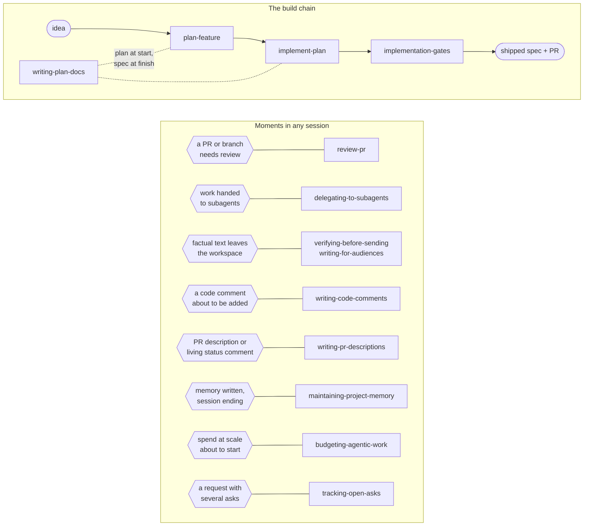
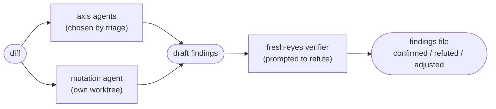
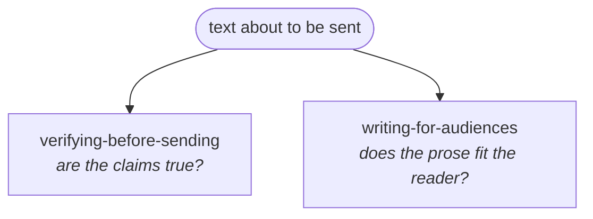
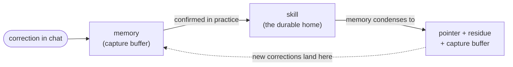

# Claude delivery skills

Fourteen [Claude Code skills](https://docs.anthropic.com/en/docs/claude-code) that harden
the path from idea to merged PR — and the moments around it. They exist because the
failure mode of agent-driven development is rarely the code itself: it is everything
around the code. Plans built on unverified claims. Tests that pass but would never have
failed. Subagent reports treated as facts. Messages that read fine and are wrong.
Comments nobody needed. Spend nobody priced.

Each skill is a `SKILL.md` instruction package. Claude Code loads it when the task
matches, and the instructions change how the model works — what it checks, in what
order, and what it refuses to skip. Every rule in them was paid for by a real incident;
the catalog below tells you which problem each one solves, so you can judge the set
without reading fourteen files.

## The map

Four skills form the build chain; the other ten guard moments that can occur in any
session, at any time.



## What each skill solves

### The build chain

**`plan-feature` — a coherent plan can still be false.**
A design that argues its premise well for three sentences can be wrong about what an
API returns or a column means — and implementation will build on it faithfully. The
skill ground-truths every claim about systems you did not write *before* the plan is
written (read-only checks: real data, then an existing consumer, then docs — a coherent
argument is not evidence), then stops so the plan can be read before anything is built.

**`implement-plan` — the gate that is not written into the plan does not run.**
Executors obey the plan, so a verification step that lives only in good intentions gets
skipped. The skill patches the plan with a gates task before execution starts, checks
the plan's premises were settled rather than argued, delegates the build to the repo's
own execution skill, and finishes by rewriting the plan as the spec of what shipped.

**`implementation-gates` — green is not the bar; "would it have gone red" is.**
Thirteen mutations once survived a suite that honestly passed: the tests could not fail.
The skill runs ten to twelve targeted mutations over the new lines (every non-equivalent
survivor is a missing assertion), re-checks the design's claims about outside systems
against evidence, and keeps written verification records to exactly what ran.

**`writing-plan-docs` — the doc describes the destination, never the route.**
Plan documents decay into changelogs — deviation lists, review-round narration, stale
counts — that mislead the person reading them later. The skill keeps the doc a
current-state spec: superseded content replaced rather than annotated, verification
records that outlive the branch, references that resolve against a tree that has moved.

### Reviewing

**`review-pr` — one careful reader misses what measurement and adversarial checks catch.**
A single reviewer finds what a single way of reading finds; and a review's own findings
are claims that can be wrong. Two passes: parallel single-axis agents (chosen from the
diff, never the full set) plus a mutation agent that measures instead of reads — then a
fresh-eyes verifier prompted to *refute* every draft finding before anything is reported.
Posts nothing without being asked.



### Working through subagents

**`delegating-to-subagents` — a subagent's output is a claim about work, not the work.**
Real incidents: a research agent invented a tool name ("confirmed from source") and the
shipped check rejected every input; delegated diffs carried the agent's monologue into
commits; and reports simply never arrived. The skill governs what dispatch
guides lack — collision-safe partitioning, delivery instructions, liveness checks before
taking over, verifying every reported identifier, auditing every delegated diff.

### The send moment — three skills, one axis each

Text about to leave the workspace fails three independent ways, so three skills fire
together and split the work:



**`verifying-before-sending` — text that reads fine and is wrong.**
A blind pass once corrected four claims in a document that had already passed
self-review, and found a defect that would have failed every run of a process another
engineer was about to build on. Fact table before writing; verification by a fresh
context that never saw the reasoning; two named traps (absence claimed from a truncated
search, a negative claimed from one function); two passes maximum, then the warrant
stated — never the feeling.

**`writing-for-audiences` — prose the reader cannot use, or should not have.**
"40%" invites "of what?"; two numbers measured under different conditions are not one
comparison; and a task description condensed from an internal backlog once delivered
interpersonal framing onto a shared board. Register matched to the reader, every number
carrying its base, an audience gate that re-derives text instead of condensing it, and
formatting for how the text is actually used — copied, spoken, skimmed.


### Writing artifacts

**`writing-code-comments` — subtractive comment rules keep failing; give the fact a home.**
"Don't write comments" collapses the moment a fact feels load-bearing — which is why
the correction kept recurring. Zero by default at write-time, an invariant-plus-cost
shape when one is earned, and the escape hatch that makes the default hold: the
load-bearing fact becomes an expression, an assertion that fails when broken, or a
named constant — never prose.

**`writing-pr-descriptions` — describe the diff, not the branch.**
Descriptions accumulate review-round narration and references that die on squash-merge.
The contract: net delta grouped by behavioral change, the deliberate scope boundary,
references that survive history rewrites — and at most one living status comment,
edited in place, never a stack.

### The session itself

**`maintaining-project-memory` — memory is a promotion tier, not a notebook.**
A line written to memory executes with full authority in a later session that cannot
question it: a stale "still to push" reads as a live obligation; a rule whose scope was
dropped at the write step fires as an absolute. Keep only what the repo structurally
cannot record; re-derive rules instead of copying wording; when content graduates into
a skill, condense the memory to a pointer, the private residue, and a capture buffer;
end continuing sessions with the literal next-session starter prompt.



**`budgeting-agentic-work` — the bill arrives after the decisions that ran it up.**
A budget wall hit mid-run loses paid work in interrupted agents; a rework round silently
doubled one pass's cost; idle servers spend and fake verification results. Phase the
work so every phase ends durable, price the pass before it runs, treat rework cost as a
process defect with a cause to fix, and stop what you started.

**`tracking-open-asks` — the trailing "and also…" is the ask that drops.**
When the requester has to re-ask, they have paid twice: once waiting, once auditing.
Every ask goes on an explicit ledger at arrival, every ask closes visibly (done,
answered, declined, or deferred — never silently), and status reports cover the whole
ledger, not the items that happened to finish.

## What a run looks like

An illustrative `review-pr` run — what the skill's contract produces, abridged:

```
> review PR 214

Axes chosen from the diff: mutation + correctness + doc-vs-code — tested
logic changed and the PR carries a spec. Say the word to add or drop one.

  [parallel subagents review a pinned worktree at commit a1b2c3d;
   the mutation agent edits files in its own worktree]

Pass 2 (fresh-eyes verifier, prompted to refute each finding):
5 confirmed, 2 refuted, 1 adjusted, 1 added by the sweep.

review-findings-214.md written — 3 medium, 4 minor. Nothing was posted;
say "post" to publish the final findings to the PR as inline threads.
```

The mutation axis measures rather than reads — its evidence looks like:

| Mutation | Result |
|---|---|
| `>=` → `>` at the window boundary | KILLED by `test_window_edges` |
| drop `retries` from the emitted row | SURVIVED → finding: the missing assertion, spelled out |

That's the default path. `review-pr` also carries, on request:
**deep mode** (a blind re-review plus one isolated skeptic per finding — this
one also fires when the repo's memory pins it),
**staged posting** (GitHub PENDING reviews, for holding publication until you
submit), **apply mode** (fixes land only after every new test is proven failing
against the pre-fix code), and **thread disposition** (reply-and-resolve with
verification that each fix actually landed). The skill files are the full
documentation — every mode is specified where the agent reads it.

## The ideas underneath

- **Green is not the bar; "would it have gone red" is the bar.** A test suite that
  honestly passes can still be too weak to catch the defect just introduced. The
  gates run ten to twelve targeted mutations over the new lines and treat every
  non-equivalent survivor as a missing assertion.
- **A coherent argument is not evidence.** Every claim about behavior you did not
  write — what an API returns, what a column means, what a tool prints — gets
  settled by a read-only check against real data, an existing consumer, or
  documentation, in that order, at the moment it is cheapest: plan time.
- **Output is a claim until verified.** A subagent's report, a reviewer's finding, a
  green gate, a draft that reads fine — each is treated as a claim about the world,
  checked against source before anything is built on it.
- **One owner per rule.** When a rule applies in several skills, one skill owns its
  statement and the others defer to it — so a refinement lands once instead of
  drifting across copies.
- **Delegate and patch, never restate.** These skills wrap a repo's own skills
  (or the [superpowers](https://github.com/obra/superpowers) set) rather than
  replacing them. What they add is the checks that chains tend to lack, inserted
  at the moments they are cheapest.
- **Records outlive sessions.** Verification sections, plan docs, and PR
  descriptions are written for the reader who arrives after the branch is merged
  and the context is gone — so they state only what ran, and reference only what
  survives history rewrites.

## Install

Claude Code discovers each `<skill>/SKILL.md` folder placed directly in a
skills directory. On a machine with no personal skills yet:

    git clone https://github.com/ViktorSoroka07/claude-delivery-skills ~/.claude/skills

If `~/.claude/skills` already has content, clone the repo elsewhere and copy
the skill folders you want into it — or into a project's `.claude/skills/` —
re-copying after each `git pull` (a nested clone puts the `SKILL.md` files one
level too deep to be discovered).

Works best alongside:

- the [superpowers](https://github.com/obra/superpowers) plugin — `plan-feature`
  and `implement-plan` delegate design, plan-writing, execution, and completion
  to its skills (`brainstorming`, `writing-plans`, `executing-plans`,
  `subagent-driven-development`, `verification-before-completion`,
  `finishing-a-development-branch`) or to a repo's own forks of them;
- an authenticated platform CLI for `review-pr` — `gh` (GitHub), `az` or a PAT
  (Azure DevOps), or `glab` (GitLab) — the three platforms it carries earned
  mechanics for.

Works on macOS, Linux, and Windows: the guard scripts are POSIX sh, which Git
for Windows already provides — hooks run under its bundled Git Bash, no extra
setup. CI exercises all three.

## Opinionated defaults

Plans live in `docs/plans/`; review findings go to an untracked MD in the repo
root, never into chat; repo-specific facts (gate commands, test commands, bot
reviewers) live in a project memory entry named `review-repo-nuances` that the
skills read and maintain. Adjust to taste — the skills state their mechanisms, so
the seams are visible.

## Beyond Claude Code

The protocols here are assistant-agnostic: the mutation-sweep protocol, the
evidence hierarchy (real data > an existing consumer > documentation > a
coherent argument), the plan-doc lifecycle, the PR-description contract, and
the finding format all lift cleanly into Cursor rules, Copilot instructions,
or an `AGENTS.md` — `writing-plan-docs` and `writing-pr-descriptions` port
almost verbatim.

The orchestration does not: subagent dispatch (parallel single-axis reviewers,
the clean-context verifier), skill-to-skill chaining, and project memory are
Claude Code machinery, and the full skills assume them. Ported without those
primitives, `review-pr` collapses into "one context reviews carefully" — the
failure mode it exists to escape. So this repo stays Claude Code-native, and
the portable parts are yours to lift.

## Provenance

These skills are distilled from real delivery work on production repositories.
Identifying details are removed; the mechanisms — each one paid for by an actual
incident — are what remain. `CONTRIBUTING.md` explains how that line is kept.

A personal project — not affiliated with or endorsed by Anthropic.
